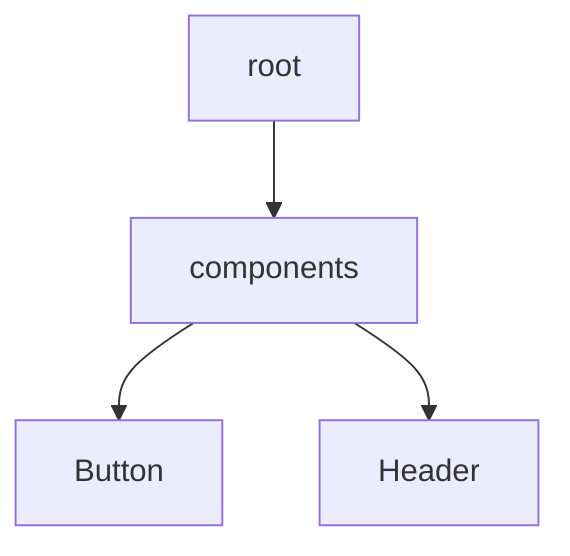

# 🚀 PropCreep Insight

> 🔎 A fast, offline-first React component explorer with built-in AI docgen superpowers — like Storybook met VS Code's tree view and got real.

---

## 📦 TL;DR

```bash
npx propcreep --input ./src --output ./docs
```

- 📁 Visualizes your full component tree  
- 🧠 Auto-generates documentation for every component  
- 📊 Shows size per file + props  
- 🧬 Mermaid-powered diagrams  
- 🤖 Optional OpenAI/Gemini integration for rich AI docs  
- 🛠 Works offline. No lock-in. No config hell.

---

## 🎯 Why PropCreep?

| Feature                   | ✅ PropCreep Insight | 🧸 Storybook | 📦 Bundle Analyzer |
|---------------------------|----------------------|--------------|--------------------|
| 🗂 Component Tree Viewer   | ✅ Yes                | ❌ No         | ❌ No               |
| 📜 Static Docgen           | ✅ Built-in           | ❌ Separate   | ❌ N/A              |
| ⚡ File Size + Weight      | ✅ Yes                | ❌ No         | ✅ Yes              |
| 🔁 AI-Generated Comments   | ✅ Optional GPT/Gemini| ❌            | ❌                  |
| 📈 Mermaid Graph Output    | ✅ Yes                | ❌ No         | ❌ No               |
| 🛠 Works Offline           | ✅ Yes                | ❌            | ✅ Mostly           |

---

## 🧑‍💻 Install & Use

```bash
npm install -g propcreep-insight
# or use it directly:
npx propcreep --input ./src --output ./docs
```

> Outputs:

- `components.json`
- `component-tree.json`
- `component-tree.mmd`

---

## 🧠 AI-Powered Doc Generation (Optional)

### OpenAI

```bash
OPENAI_API_KEY=sk-xxx npx propcreep --ai openai
```

### Gemini

```bash
GEMINI_API_KEY=xxx npx propcreep --ai gemini
```

---

## 🧾 Example Output (Static)

```markdown
### 📦 Button
**Path**: `src/components/Button.jsx`  
**Size**: 2.1 KB

#### Props:
- `label`: string  
- `onClick`: function  

---
Autogenerated by PropCreep Insight (static mode)
```

---

## 🖼 Mermaid Graph Output

From `component-tree.mmd`:



---

## 🛠 CLI Options

| Flag             | Description                                 | Default          |
|------------------|---------------------------------------------|------------------|
| `--input` or `-i` | Input directory to scan                    | `./src`          |
| `--output` or `-o`| Output folder for JSON/docs                | `./docs`         |
| `--ai`           | `openai`, `gemini`, or skip for static      | `static`         |

---

## 🧠 Local Viewer (Optional)

```bash
cd ui
npm install
npm run dev
```

Open [http://localhost:5173](http://localhost:5173) to explore your component insights, Mermaid graph, and docs.

---

## 📦 .env Support

```env
OPENAI_API_KEY=sk-xxx
GEMINI_API_KEY=xxx
PROP_AI_MODE=static
```

---

## ✅ Roadmap

- [x] Component tree generation  
- [x] Static docgen  
- [x] Mermaid graph export  
- [x] File size analysis  
- [x] AI-enhanced docs (OpenAI/Gemini)  
- [ ] Component churn analysis  
- [ ] Unused export detection  
- [ ] CI mode for PR comments  

---

## 👨‍💻 Built For

- Frontend engineers tired of Storybook boilerplate  
- Architects visualizing component sprawl  
- Teams needing lightweight insights before shipping  
- OSS authors showing off clean component APIs  

---

## 🧠 Powered By

- React  
- Babel parser  
- Mermaid  
- OpenAI + Gemini (optional)  
- Commander.js  
- fs-extra + globby  

---

## 🧙 About the Creator

**PropCreep Insight** is crafted by [Manjunatha], for devs who want speed, insight, and real offline power.No fluff. No BS. Just actionable structure and smart docs.

---

## 📜 License

This project is licensed under the
MIT License. See [LICENSE](./LICENSE) for details.
