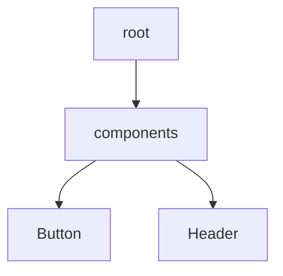

# 🚀 PropCreep Insight

> 🔎 A fast, offline-first React component explorer with built-in AI docgen superpowers — like Storybook met VS Code's tree view and got real.

---

## 📦 TL;DR

```bash
# Basic static docgen
npx propcreep-insight --input ./src --output ./docs

# Default (static) with viewer
npx propcreep-insight --view

# OpenAI mode
npx propcreep-insight --ai openai --openai-key sk-abc123 --view

# Gemini mode
npx propcreep-insight --ai gemini --gemini-key gem-abc123 --view
```

- 🧩 Visualizes component structure  
- 📜 Generates static docs with prop metadata  
- 📊 Shows per-component size insights  
- 🧬 Mermaid-powered component trees  
- 🤖 Optional GPT/Gemini doc generation  
- 🛠 Works 100% offline (unless AI is enabled)

---

## 🎯 Why PropCreep?

| Feature                   | ✅ PropCreep Insight | 🧸 Storybook | 📦 Bundle Analyzer |
|---------------------------|----------------------|--------------|--------------------|
| 🗂 Component Tree Viewer   | ✅ Yes                | ❌ No         | ❌ No               |
| 📜 Static Docgen           | ✅ Built-in           | ❌ Separate   | ❌ N/A              |
| ⚡ File Size + Weight      | ✅ Yes                | ❌ No         | ✅ Yes              |
| 🔁 AI-Generated Comments   | ✅ GPT/Gemini (opt-in)| ❌            | ❌                  |
| 📈 Mermaid Graph Output    | ✅ Yes                | ❌ No         | ❌ No               |
| 🛠 Works Offline           | ✅ Yes                | ❌            | ✅ Mostly           |

---

## 📥 Install & Use

```bash
npm install -g propcreep-insight
# or just run directly
npx propcreep-insight --input ./src --output ./docs --view
```

Outputs:

- `components.json`
- `component-tree.json`
- `component-tree.mmd`
- 📁 Self-contained viewer at `./propcreep-report/`

---

## 🧠 AI Doc Generation (Optional)

```bash
# OpenAI
OPENAI_API_KEY=sk-xxx npx propcreep-insight --ai openai

# Gemini
GEMINI_API_KEY=xxx npx propcreep-insight --ai gemini
```

Or use a `.env` file:

```env
PROP_AI_MODE=gemini
OPENAI_API_KEY=sk-xxx
GEMINI_API_KEY=gem-xxx
```

---

## 🖼 Viewer UI (Static Site)

After generation, you’ll get:

```
propcreep-report/
├── index.html
├── assets/
└── data/
    ├── components.json
    └── component-tree.json
```

### Launch locally

```bash
npx propcreep-insight --view
# or manually:
npx serve ./propcreep-report -l 5173 -s
```

---

## 📈 Mermaid Graph

From `component-tree.mmd`:



---

## 🔧 CLI Flags

| Flag             | Description                                 | Default          |
|------------------|---------------------------------------------|------------------|
| `--input` / `-i` | Input component directory                   | `./src`          |
| `--output` / `-o`| Output folder for JSON/docs                 | `./docs`         |
| `--ai`           | `openai`, `gemini`, or omit for static mode | `static`         |
| `--openai-key`   | OpenAI API key                              | from `.env`      |
| `--gemini-key`   | Gemini API key                              | from `.env`      |
| `--view` / `-v`  | Launch the UI viewer after generation       | `false`          |

---

## 🧪 Local Dev (Viewer)

```bash
cd ui
npm install
npm run dev
```

To test viewer with actual data:

```bash
cp -r ../docs ui/public/data
```

Then open [http://localhost:5173](http://localhost:5173)

---

## 💬 Feedback & Contributions

Have ideas or bugs?

- Submit feedback: [GitHub Issues](hhttps://github.com/manjunani/PropCreep/issues)
- Or open a PR — we welcome contributions 🙌

---

## ✅ Roadmap

- [x] Component tree generation  
- [x] Static docgen  
- [x] Mermaid graph export  
- [x] File size analysis  
- [x] AI-enhanced docgen (GPT/Gemini)  
- [ ] Component churn tracking  
- [ ] PR comment bot integration  
- [ ] Markdown export for GitHub READMEs  

---

## 🧠 Powered By

- React  
- Babel parser  
- Mermaid.js  
- OpenAI + Gemini  
- Commander.js  
- fs-extra + globby  

---

## 🧙 About the Creator

**PropCreep Insight** is built by [Manjunatha Sai Uppu](https://github.com/manjunani) with ❤️ to help frontend engineers stay fast, informed, and in control of their codebase.

> If you love it, ⭐ star it, share it, and send your feedback.

---

## 📜 License

MIT — [LICENSE](./LICENSE)
